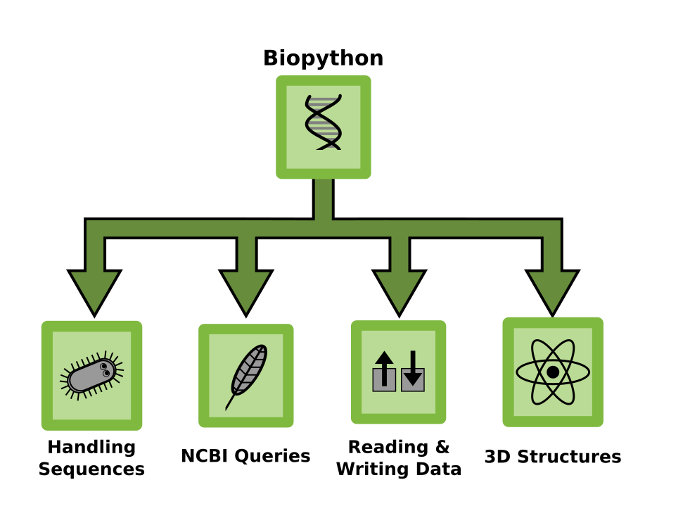

# Biopython Tutorial for Python 3

Course material by Dr. Kristian Rother

with contributions by Allegra Via, Magdalena Rother and Olga Sheshukova.

## What is Biopython?

Biopython is a Python library for reading and writing many common biological data formats. It contains some functionality to perform calculations, in particular on 3D structures.

**The library and documentation** can be found at [www.biopython.org](http://www.biopython.org).

## Preparations

Download the material from [github.com/krother/Biopython_Tutorial](https://github.com/krother/Biopython_Tutorial)

## Contents

* [First Steps](first_steps.md)
* [Using NCBI E-utilities](ncbi_eutils.md)
* [Diagnosing Sickle Cell Anemia](sicklecell.md)
* [BLAST](BLAST.md)
* [Analyzing tabular data with pandas](pandas.md)
* [Biopython Examples](biopython_ref.md)

## Authors

© 2015 Kristian Rother (krother@academis.eu)

This document contains contributions by Allegra Via, Magdalena Rother and Olga Sheshukova.
I would like to thank Pedro Fernandes, Janick Mathys, Janusz M. Bujnicki and Artur Jarmolowski for their support during the courses in which the material was developed.

## License

This tutorial is distributed under the conditions of the **Creative Commons Attribution Share-alike License 4.0** (CC-BY-SA 4.0).
