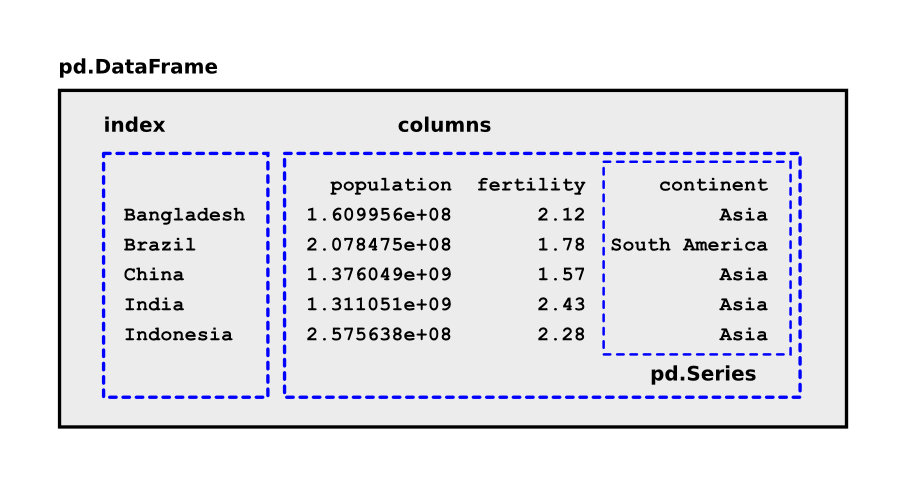

# Analyzing tabular data with pandas

**featuring the human proteome**

## pandas

Pandas is the de-facto standard to read, analyze and visualize tabular data from CSV files, Excel tables and many more.

The main data structure for tables is called **DataFrame**:

### Installing pandas

    pip install pandas
    pip install matplotlib

## Your Task

1. Make sure you have the file `human_proteome.csv`.
2. Execute the paragraphs below in an interactive Python console.
3. Find out what each code segment does.

### Exercise 1

    import pandas as pd
    import pylab as plt

    df = pd.read_csv('human_proteome.csv', index_col=0)
    df.head()

### Exercise 2

    df['name']
    df[['name', 'length']]

### Exercise 3

    df.sum()

### Exercise 

    df['W'].mean()
    df['W'].std()

### Exercise 5

    df.describe()

### Exercise 6

    df[df['length'] > 5000]

### Exercise 7

    df.sort_values('length', ascending=False).head(10)

### Exercise 

    df['H_percent'] = df['H'] / df['length']
    df.sort_values('H_percent', ascending=False).head(20)

### Exercise 9

    def match_name(name, query):
        return query in name

    hemo = df['name'].apply(match_name, args=["Hemoglobin"])
    df[hemo]

### Exercise 10

    df.plot.scatter('K', 'R')
    plt.axis([0, 1000, 0, 500])
    plt.savefig('scatterplot.png')

### Exercise 11

    plt.figure()
    short = df[df['length'] < 1000]
    short['length'].hist(bins=50)
    plt.savefig('lengths.png')

## Where to learn more?

* on the [pandas homepage](https://pandas.pydata.org/)
* in the book [Python for Data Analysis](http://shop.oreilly.com/product/0636920050896.do)
