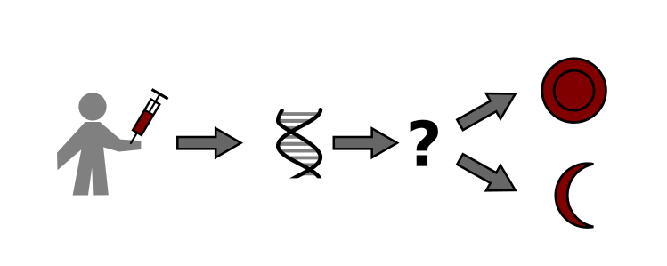
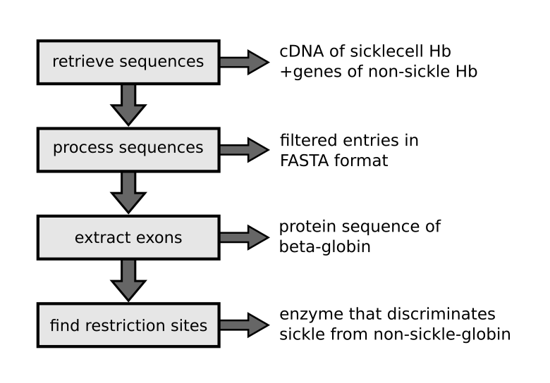

# Project: Diagnosing Sickle Cell Anemia

**Programming tasks with Biopython**

## Goal

Your goal is to develop an experimental test that reveals whether a patient suffers from the hereditary disease sickle cell anemia. The test for diagnosis should use a restriction enzyme on a patients’ DNA sample. For the test to work, you need to know exactly what genetic difference to test against. In this tutorial, you will use Biopython to find out.

The idea is to compare DNA and protein sequences of sickle cell and healthy globin, and to try out different restriction enzymes on them. 

This tutorial consists of four parts:

1. Use the module `Bio.Entrez` to retrieve DNA and protein sequences from NCBI databases.
2. Use the module `Bio.SeqIO` to read, write, and filter information in sequence files.
3. Use the modules `Bio.Seq` and `Bio.SeqRecord` to extract exons, transcribe and translate them to protein sequences.
4. Use the module re to identify restriction sites.

**Have fun!**

----

### What is sickle cell anemia?

At the beginning of the course, watch the 5-minute movie **"Sickle Cell Anemia"** by Paulo César Naoum and Alia F. M. Naoum: **[http://www.youtube.com/watch?v=R4-c3hUhhyc](http://www.youtube.com/watch?v=R4-c3hUhhyc)**.

----

## 1. Retrieving DNA and protein sequences with Bio.Entrez

### 1.1 Search identifiers on NCBI

Write Python code that searches for the cDNA sequence of the sickle cell globin protein from NCBI.
Use the `Entrez.esearch` function. As keywords, use:

    sickle AND homo sapiens AND globin NOT chromosome 

Print the resulting database identifiers (not the full sequences).

Use the NCBI examples from the previous chapter.

### 1.2 Retrieve sequences using identifiers

Use the identifiers from task 1.1, retrieve the full sequence with the `Entrez.efetch` function from the NCBI server. 

The parameter `rettype` should be `'fasta'`, `retmode`should be `'xml'`.

Print the identifier and defline for each entry using a for loop. 

You can see the available fields for a single record with:

    print(r.keys())

### 1.3 Retrieve a single GenBank entry

In the output of task 1.2, locate the cDNA of the sickle cell globin *manually*. Copy the identifier. Use the identifier to download the full GenBank entry only for that sequence with `efetch`. Print the entry.

The parameter `rettype` should be ‘gb’, `retmode`should be `'text'`.

### 1.4 Write an output file

Save the GenBank entry from task 1.3 to a file ‘sickle.gb’.

### 1.5 Retrieve and write multiple GenBank entries

Combine `esearch`  and `efetch` to retrieve entries for the gene sequences of the human globin family. Find appropriate keywords to limit the search to beta-globin and only complete coding sequences. Write the outcome to a file.

#### Hint: 
It is often more convenient to design the query in a browser window before moving to Python.

### 1.6 Optional Exercises

* Save the retrieved entries to a single FASTA file.
* Save each of the beta-globin sequences to a separate GenBank file.
* Use Entrez to search 100 recent references related to malaria and sickle cell anemia on PubMed.

----

## 2. Bio.SeqIO

**Reading, writing, and filtering sequence files**

### 2.1 Read a GenBank file

Read the ‘sickle.gb’ file from task 1.4 using the `SeqIO.parse()` function:

    from Bio import SeqIO

    records = SeqIO.parse(filename, format)

The first parameter of `parse()` is the filename, the format is ‘genbank’. Print the `records` object.

To see the actual entries, use the `next()` function on `records` or process the `records` in a `for` loop:

    rec = next(records)

### 2.2 Print information for one sequence

Use the `dir()` function on a single record object to find out what attributes it has.

Print the id, name and description of the sickle cell globin entry.

### 2.3 Write a FASTA file

Save the GenBank entry from task 2.1 to a FASTA file using the `SeqIO.write()` function:

    SeqIO.write(records, file, format)

The first parameter of `write()` is a list of sequence records, the second a file open for writing, and the third should be ‘fasta’.

### 2.4 Print information for multiple sequences

Print the id, name, and description of all human beta-globins.

#### Hint:
This is a great occasion to exercise string formatting, e.g. to obtain a tabular output:

    print("{:10s} {:7d}".format('Ada', 33))

### 2.5 Filtering sequence entries

Print the same information as in task 2.4, but do not show non-globin entries. If the description contains either ‘vector’ or ‘isolate’, don’t print anything.

### 2.6 Optional Exercises

* collect the entries matching all criteria in a new list
* save the filtered list to a FASTA file
* Filter the list of sequence entries even further using your own criteria

----

## 3. Bio.Seq and Bio.SeqRecord

**Working with sequences**

### 3.1 The DNA sequence

Read the sequence of the sickle cell globin cDNA. Print the DNA sequence. Use the `seq` attribute of the `SeqRecord` object from the previous exercise:

    sequence = rec.seq

### 3.2 Transcribe DNA to RNA

Transcribe the sickle cell cDNA sequence to RNA and print it. Use the `transcribe()` method of the `Seq` object.

### 3.3 Translate RNA to protein

Translate the sickle cell RNA to a protein sequence and print it. Use the `translate()` method of a `Seq` object.

Save the protein sequence to a separate file.

### 3.4 Analyze annotations of beta-globin

In the file with many globins, find the beta-globin entry with accession `L26462`. Use the field `r.annotations['accessions']` on a `SeqRecord` object to find it. Write the entry to a separate GenBank file.

### 3.5 Extract sequence features

Print all features of the L26452 entry. Use the field `r.features` on a `SeqRecord` object.

### 3.6 Extract exons

Print all exon features and their attributes `start`, `end` and `nofuzzy_start`, `nofuzzy_end`:

    for feature in seq['features']:
        print(feature)
        ...
        # add printing attributes here

For each exon, extract the interval

    feature[nofuzzy_start:nofuzzy_end]

Use the indices to extract portions of the complete sequence. Concatenate all exon sequences to a single string.

### 3.7 Extract the beta-globin protein sequence

Transcribe and translate the concatenated exon sequence and print it.

### 3.8 Results

Print the sickle cell and healthy beta-globin sequence in subsequent lines or a text file. Also print the two corresponding protein sequences in subsequent lines. What differences do you see?

### 3.9 Optional Exercises

* What are the ‘N’ characters in the sickle cell globin cDNA? How did they affect the transcription/translation?
* Check in the documentation how to read an alignment of multiple sequences using Biopython
* Propose a PCR primer that specifically recognizes the sickle cell gene.

----

## 4. Pattern Matching
**Identification of restriction sites**

### 4.1 Familiarize with Regular Expressions

Do the first 3-4 exercises on the RegexOne website (http://www.regexone.com)

Experiment with the [Regex101](http://www.regex101.com) website. 

### 4.2 Search for a start codon

Use the `re.search()` function to locate the start codon (ATG) in the cDNA sequence of healthy beta-globin. The first parameter is a search pattern string, and the second is the string to be searched:

    import re

    match = re.search('ATG', sequence)
    if match:
        print(match.start, match.stop)

### 4.3 Search for a restriction site

Create a regular expression using the `re.compile()` function for the restriction enzyme **DdeI** (cuts at `NN^CTNAG`). Search with a regular expression in both sickle cell and beta-globin DNA sequences. 

For simplicity, copy-paste both sequences to string variables in your program.

If the search method returns a match, print the start and stop found in both DNA sequences.

### 4.4 Try more restriction enzymes

Test patterns for the restriction sites of:

    HinfI (GTNNAC)
    BceAI (ACGGCNNNNNNNNNNNNN)
    BseRI (GAGGAGNNNNNNNNNN)
    EcoRI (GAATTC)
    MstII (CCTNAGG) 

on both DNA sequences. Which restriction enzyme could you use to specifically identify carriers of the sickle cell anemia gene?

### 4.5 Replace missing characters

To facilitate the restriction analysis, replace the N's in the sickle cell DNA by the corresponding positions from the healthy DNA. Print the resulting DNA sequence.
